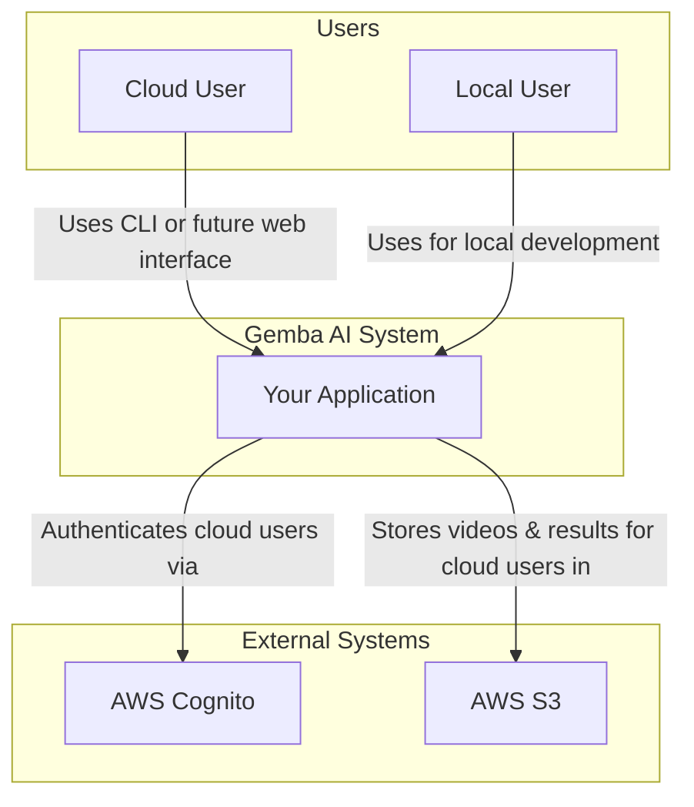

# System Context Diagram

This diagram shows the high-level context of the Gemba AI system, its users, and the external systems it interacts with.

## Description

*   **Users:** There are two main types of users. The `Cloud User` who interacts with the production system, and the `Local User` (developer) who runs the system on their own machine.
*   **Gemba AI System:** This is the system you are building, composed of all your microservices.
*   **External Systems:**
    *   **AWS Cognito:** Used for handling user sign-up and login for the cloud deployment.
    *   **AWS S3:** The cloud object storage for videos and processing results.
